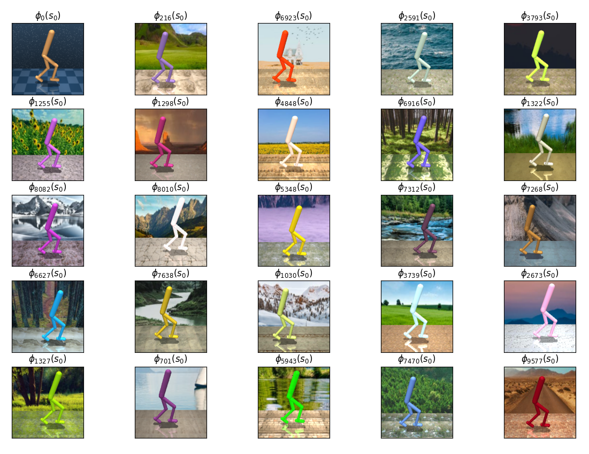
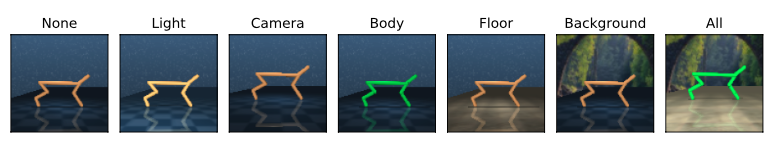
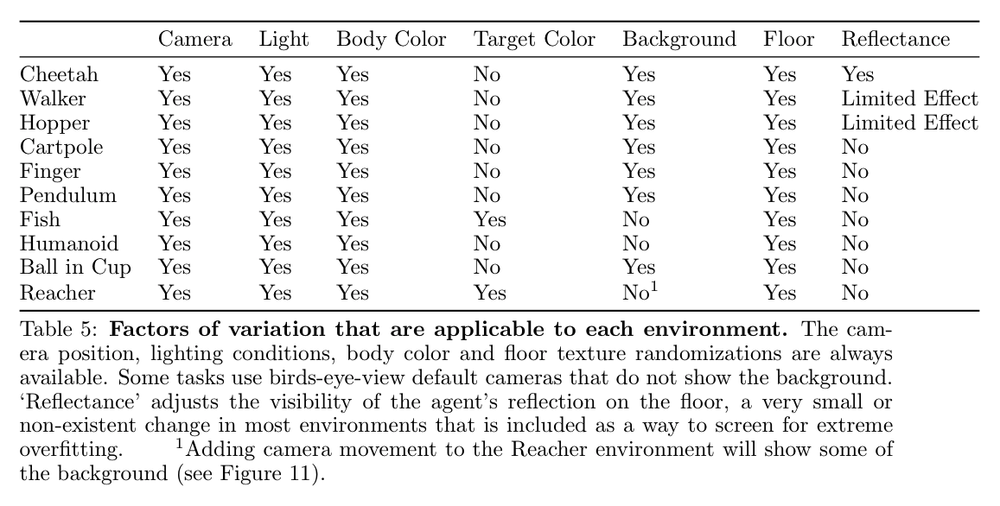

# DMC Remastered
#### A version of the DeepMind Control Suite with randomly generated graphics, for measuring visual generalization in continuous control.



### What is this?
The DeepMind Control Suite (DMC) [(Tassa et al., 2018)](https://arxiv.org/abs/2006.12983), is a popular collection of simulated robotics tasks that is used to benchmark Deep Reinforcement Learning algorithms. Recent work has focused on learning to solve these tasks based only on images of the environment [(Srinivas et al., 2020)](https://arxiv.org/abs/2004.04136) [(Kostrikov et al., 2020)](https://arxiv.org/abs/2004.13649) [(Laskin et. al, 2020)](https://arxiv.org/abs/2004.14990) [(Yarats et al., 2019)](https://arxiv.org/abs/1910.01741). If similar techniques are going to be succesful in the real world, they'll need to be able to operate in a variety of visual conditions. Small differences in lighting, camera position, or the surrounding environment can dramatically alter the raw pixel values presented to an agent, without affecting the underlying state. Ideally, agents would learn representations that are invariant to task-irrelevant visual changes.

To measure this, we create a modified version of DMC with an emphasis on visual diversity. 

Environments are given a new "visual seed", which significantly modifies the appearance of the MuJoCo renderings while leaving the transition dynamics untouched. This allows the same sequence of states to be rendered in millions of distinct ways. When initialized, our environments make a sequence of pseudo-random graphical choices, deterministically seeded by the ***visual seed***:

1) **Floor**. The floor's pattern is sampled from a game design pack that includes hundreds of rock, grass, soil, sand, ice and concrete textures. 
2) **Background**. The background is sampled from a collection of natural landscape photos.
3) **Body Color**. The color of the robot's body is sampled from the full RGB space. If there is another MuJoCo body in the scene (e.g., the glowing target location in Reacher, Reach), it is given a second random color.
4) **Camera and Lighting**. The camera's position and rotation are sampled uniformly within a relatively small range that varies across each domain.  Lighting position is chosen similarly, along with other properties like ambience and diffusion. The limits of these distributions were determined by generating a large number of seeds across each domain and ensuring that there was sufficient variation without hiding important task information.

These simple alterations are enough to create an enormous amount of variety. We also allow each type of adjustment to be toggled on or off independently, and deterministic seeding makes it easy to train or evaluate multiple agents in the same environments. The initial release includes 10 of the DMC domains for a total of 24 tasks.

Importantly, we decouple the visual seed from the random seed that is already present in DMC tasks, determining the robot's initial position. During training, each reset generates a new starting position, as usual. We re-brand the original random seed as the "***dynamics seed***" for clarity.


### Installation
First, you'll need to install [dm_control](https://github.com/deepmind/dm_control). If you don't already have a MuJoCo license, we've [written up some instructions](mujoco.md) based on our experience setting up student licenses.
```bash
git clone https://github.com/jakegrigsby/dmc_remastered
cd dmc_remastered
pip install -e .
```
Then...
```python
import dmc_remastered as dmcr
```

### Benchmarks
DMCR contains 3 basic benchmarking setups:
1) **"Classic"** loads a training and testing environment that have the same visual seed. Each reset samples a new dynamics seed and keeps the visual seed fixed. This is the typical RL setup where we're evaluating on the same environment we trained in.

```python
# train and test on visual seed 6985 of the "Walker, Walk" task
train_env6985, test_env6985 = dmcr.benchmarks.classic("walker", "walk", visual_seed=6985)

# visual_seed = 0 restores the original DMC visuals
train_env_original, test_env_original = dmcr.benchmarks.classic("walker", "walk", visual_seed=0)
```

2) **"Visual Generalization"** creates a training environment that selects a new visual seed from a pre-set range after every `reset()`, while the testing environment samples from visual seeds 1-1,000,000. By adjusting how many different training levels the agent has access to during training, we can measure visual generalization to the full test set.

```python
# create a training environment with 100 different seeds
train_env, test_env = dmcr.benchmarks.visual_generalization("hopper", "stand", num_levels=100)
```

3) **"Visual Sim2Real"** (sort of) approximates the challenge of transferring control policies from simulation to the real world by measuring how many distinct training levels the agent needs access to before it can succesfully operate in the original DMC visuals that it has never encountered.

```python
train_env, original_test_env = dmcr.benchmarks.visual_sim2real("cheetah", "run", num_levels=100)
```

### How the Paper Evaluates Zero-shot Generalization
Limited compute made it impractical to test on the Visual Generalization or Visual Sim2Real benchmarks in a way that was rigorous enough to publish. Instead, the paper focuses on the zero-shot generalization setting where we train in one environment and then evaluate on many. This can *almost* be reproduced by using `visual_generalization(..., num_levels=1)`, but in the paper we specifically train on `visual_seed=0`. We also evaluate on multiple dynamics seeds per visual seed, which is not the behavior you'll get by simply resetting the test env (each reset samples a new visual seed *and* a new dynamic seed). Here's a sketch of how to replicate the paper's main results:

```python
train_env, _ = dmcr.benchmarks.classic(domain, task, visual_seed=0)

# train the agent with your RL library of choice
agent.train(train_env)

returns = []
for _ in range(100):
    visual_seed = randint(1, 100000000)
    _, test_env = dmcr.benchmarks.classic(domain, task, visual_seed=visual_seed)
    # evaluate the agent in this visual seed for multiple episodes (a.k.a. dynamics seeds)
    mean_return = agent.evaluate(test_env, episodes=3)
    returns.append(mean_return)
final_score = mean(returns)
```

### Varying Individual Factors
The benchmark functions includes the option to toggle each variation on or off. For example, you can only change the floor, or the body color, or the background, or any combination of the 7 'factors of variation':



This is done by setting the `vary` argument. The default is a list of `["bg", "floor", "body", "target", "reflectance", "camera", "light"]`, which you can find in the `dmc_remastered.DMCR_VARY` variable. Before each change goes into the xml file that will be used to render the environment, DMCR checks to make sure it's string code is in the `vary` list. 
```python
# create environments that only vary the floor texture
vg_vary_floor_train, vg_vary_floor_train = dmcr.benchmarks.visual_generalization("walker", "walk", num_levels=100, vary=["floor"])

# create environments that only vary the robot's body color
vg_vary_body_train, vg_vary_body_train = dmcr.benchmarks.visual_generalization("walker", "walk", num_levels=100, vary=["body"])
```



### Pick a Specific Visual Seed *and* Dynamics Seed
Sometimes it's necessary to load a pre-set dynamics seed, which does not change at `reset()`. You can do this with:
```python
# make an environment with a dynamics seed of 298 and a visual seed of 13 (for some reason)
env = dmcr.wrapper.make("cheetah", "run", dynamics_seed=298, visual_seed=13)
```

### Other Details
You can adjust other important settings like image height, width, frame stack and frame skip like this:
```python
train_env, test_env = dmcr.benchmarks.visual_generalization("hopper", "stand", num_levels=100, frame_stack=3, frame_skip=4, height=100, width=100)
```

### Example Training Process for SAC+AUG
The paper finds that data augmentation approaches like [DrQ](https://arxiv.org/abs/2004.13649) and [RAD](https://arxiv.org/abs/2004.14990) are the most effective at zero-shot generalization. Rather than benchmark those two algorithms separately (and also because this project began as a way to research more involved augmentations like Style Transfer and other color shifts), we implement our own Pixel SAC variant that incorporates ideas of both. The code for that agent can be found [here](https://github.com/jakegrigsby/deep_control/blob/master/deep_control/sac_aug.py), and an example training script can be found [here](https://github.com/jakegrigsby/deep_control/blob/master/examples/dmcr/sac_aug_dmcr.py).


### Versions and Roadmap
It's likely that DMCR will get a version 2 with a much higher difficulty level before the end of 2020. This will at least include hundreds of additional background and floor textures, along with more variaiton in camera position. We also plan on adding the option for changes in environment dynamics like wind, limb size, friction, etc., which will make for an interesting test where the agent needs to learn to be invariant to some changes (visual) while learning to identify and adapt to others (dynamics). However, a benchmark that gradually changes difficulty isn't much of a benchmark, so we will keep a version 1.0 branch maintained.

### Credits
DMCR uses large chunks of code from [dmc2gym](https://github.com/denisyarats/dmc2gym) - which wraps the core environment in a gym-like interface - and, of course, from [DMC](https://github.com/deepmind/dm_control).

The floor texture images are from http://texturelib.com/. The background images are free stock photos from https://www.pexels.com.

### Citation
If you use DMCR in your research, please feel free to cite our paper:
```
@misc{grigsby2020measuring,
      title={Measuring Visual Generalization in Continuous Control from Pixels}, 
      author={Jake Grigsby and Yanjun Qi},
      year={2020},
      eprint={2010.06740},
      archivePrefix={arXiv},
      primaryClass={cs.LG}
}
```