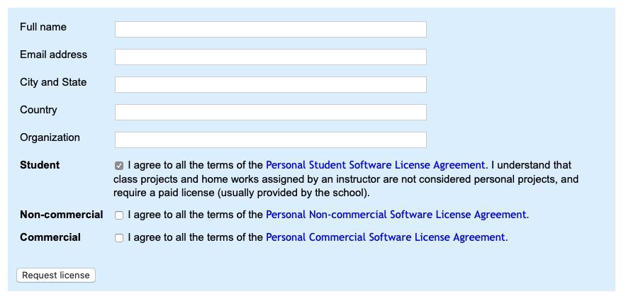
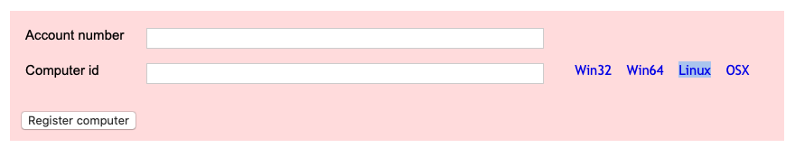
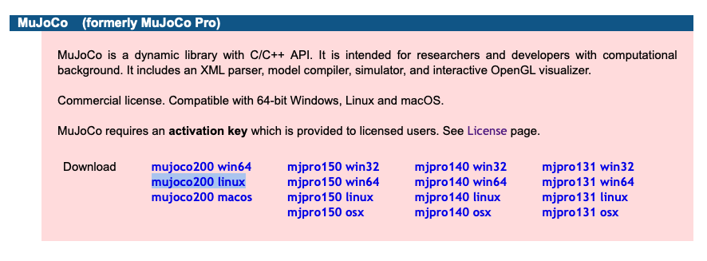

# Yet Another MuJoCo Installation Guide
1) Visit https://www.roboti.us/license.html
2) If you are a student, or work with a student, and don't already have a license, fill out the blue shaded section with a `.edu` email:



3) Eventually, you'll get an email with a long account number. Save that somewhere.

4) Log on to the server **you will be training your agents on**. Don't waste the license on your personal laptop. Student licenses are tied to a single machine, and even institutional licenses have a three machine max. This is easily the biggest obstacle to working on MuJoCo environments.

5) Copy the download link for your operating system from the 2nd pink section of the roboti webiste:


Then download the activation script. On Linux:
```bash
wget https://www.roboti.us/getid/getid_linux
chmod u+x getid_linux
```

6) Run the downloaded script (`./getid_linux`). It will return the Computer ID of the machine you are currently logged into.

7) Paste the account number that was emailed to you, along with the Computer ID you were just given, into the pink registration section. After you click "Register computer", you should get an email with an attachment called `mjkey.txt`.

8) `scp` the `mjkey.txt` file onto your training server.

9) Visit https://www.roboti.us/index.html. Copy the link to the correct version of `mujoco200` for your operating system:



10) Download the mujoco software to your machine (`wget https://www.roboti.us/download/mujoco200_linux.zip`), and unzip (`unzip mujoco200_linux.zip`).

11) Now, you may need to do some reorganization. It's easiest to put this software in your home directory (`~/`), because that's where `dm_control` will look for it by default.
```bash
mv mjkey.txt ~/
mv mujoco200_linux ~/
cd ~/
mkdir .mujoco
mv mujoco200_linux .mujoco/
mv mjkey.txt .mujoco/
```

12) To make sure everything will work, we need to set a couple of environment variables:

```bash
# dm_control
export MJKEY_PATH=~/.mujoco/mjkey.txt
# gym
export LD_LIBRARY_PATH=$LD_LIBRARY_PATH:~/.mujoco/mujoco200/bin
export MUJOCO_PY_MJKEY_PATH=~/.mujoco/mjkey.txt
export MUJOCO_PY_MUJOCO_PATH=~/.mujoco/mujoco200/
```

13) If you plan on rendering images of the environment (required for DMCR), you'll need to make sure `mujoco_py`'s rendering backend is set up correctly. I ran into some trouble here, and after a brief skim through the dm_control readme, ran `export MUJOCO_GL="osmesa"`, which seemed to work fine. That was a mistake that cost me hundreds and hundreds of compute hours on the DMCR project. **You should definitely take the time to get the EGL backend working (`export MUJOCO_GL="egl"`) which runs much, much faster on the GPU**.

14) `pip install dm_control`